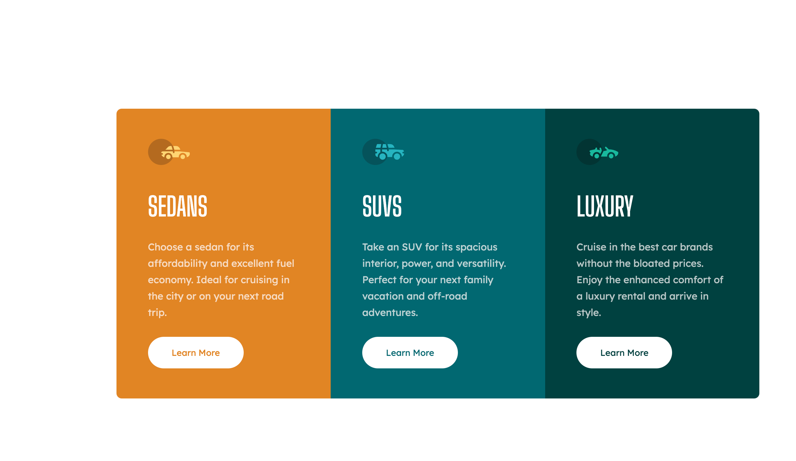

# 3-column-preview-card-component  🚗🚙🌟

## Preview



```markdown
# 3-Column Preview Card Component 🚗🚙🌟

A visually stunning 3-column preview card component to showcase different categories or products on your website.

## Features 🌟

- Three distinct card styles for different content categories.
- Responsive design for seamless viewing on various devices.
- Easily customizable to match your website's branding and content.

## Usage 🚀

1. **Include the Stylesheet:**

   Link the CSS stylesheet in the `<head>` section of your HTML file:

   ```html
   <link rel="stylesheet" type="text/css" href="css/styles.css">
   ```

2. **HTML Structure:**

   Create the HTML structure for each card in your HTML file. You can customize the content within each card as needed:

   ```html
   <ul class="cards-container">
       <li class="card sedans-card">
           <!-- Card content here -->
       </li>
       <!-- Repeat for additional cards -->
   </ul>
   ```

3. **Customize Styles:**

   Customize the card styles by modifying the CSS variables and classes in the `styles.css` file. You can change colors, fonts, and other visual elements to match your website's design.

4. **Responsive Design:**

   The component is designed to be responsive, but you can further adjust its appearance for different screen sizes by adding CSS rules in the respective media queries (e.g., small screens, medium screens, large screens, etc.) in the `styles.css` file.

## Credits 🙌

- The project uses Google Fonts for typography:
  - [Big Shoulders Display](https://fonts.google.com/specimen/Big+Shoulders+Display)
  - [Lexend Deca](https://fonts.google.com/specimen/Lexend+Deca)

## License 📝

This project is open-source and available under the [MIT License](LICENSE).

## Author 👨‍💻
Hesham El Masry

## Feedback and Contributions 🤝

If you have any feedback or suggestions or would like to contribute to this project, please feel free to [open an issue](https://github.com/heshamelmasry77/3-column-preview-card-component/issues) or submit a pull request.

```

